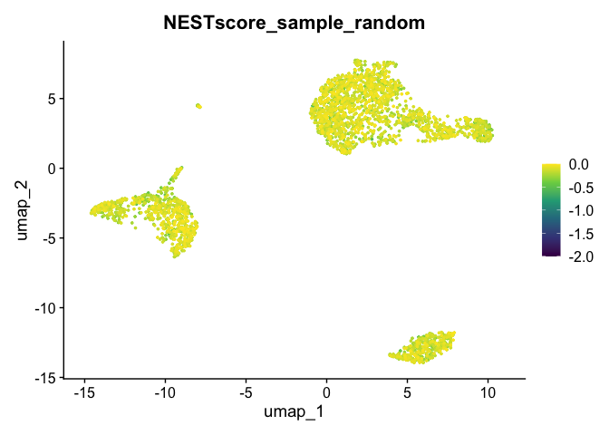
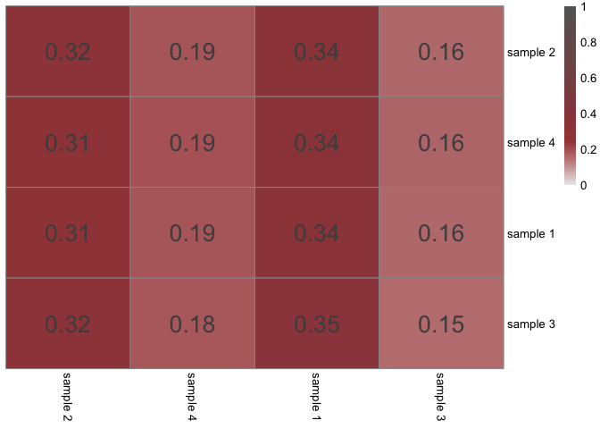

<!-- README.md is generated from README.Rmd. Please edit that file -->

# NEST-Score

This repository includes the R package `NEST-Score` (NEighbourhood
Sample homogeneiTy-Score) as introduced in “*Reconstitution of Human
Brain Cell Diversity in Organoids via Four Protocols*” ([Naas et al.
2024](#ref-naas_reconstitution_2024)).

It is compatible with a typical `Seurat`([Hao et al.
2024](#ref-hao_dictionary_2024)) workflow to analyse single-cell
RNA-sequencing (scRNA-seq) data.

## Installation

You can install the development version of `NEST-Score` R Package with:

``` r
# install.packages("devtools")
devtools::install_github("jn-goe/NESTScore")
```

## Example

This is an exemplary workflow using NEST-Score on the PBMC 3k dataset
provided by `SeuratData` (see the respective [GitHub
repository](https://github.com/satijalab/seurat-data)). For details on
the scRNA-seq object pre-processing see the corresponding [Seurat
tutorial](https://satijalab.org/seurat/articles/pbmc3k_tutorial.html):

``` r
library(Seurat)
library(SeuratData) 
library(ggplot2)
library(NESTscore)

data('pbmc3k') 
obj <- UpdateSeuratObject(pbmc3k)

# quality control
obj[["percent.mt"]] <- PercentageFeatureSet(obj, pattern = "^MT-")
obj <- subset(obj, subset = nFeature_RNA > 200 & nFeature_RNA < 2500 & percent.mt < 5)

# pre-processing 
obj <- NormalizeData(obj)
obj <- FindVariableFeatures(obj, nfeatures = 2000)
obj <- ScaleData(obj)
obj <- RunPCA(obj)
obj <- RunUMAP(obj, reduction = "pca", dims = 1:10)

DimPlot(obj, group.by = "seurat_annotations")
```


Let’s create an artificial sample assignment `sample_random` for every
cell in the dataset, which has non-uniform global frequencies and shows
a near-perfect mixedness of samples across the whole dataset:

``` r
obj$sample_random <- sample(c(rep(1,3),rep(2,3),3,4), dim(obj)[1], replace = T)
obj$sample_random <- paste0("sample ", obj$sample_random)
table(obj$sample_random)
#> 
#> sample 1 sample 2 sample 3 sample 4 
#>     1009      987      319      323

DimPlot(obj, group.by = "sample_random")
```


To not only visually evaluate how well the samples mix, we can compute
the cell-wise NEST-Score as follows:

``` r
NESTres <- NESTscore(obj, group_by = "sample_random", k_nn = 30, ndims = 50)
FeaturePlot(NESTres$seuratobj, feature = "NESTscore_sample_random", order = T) +
  scale_color_viridis_c(limits = NESTres$NESTscore_limits)
```



We can observe uniformly high NEST-Scores since all samples are
represented in all cell neighborhoods (`k_nn = 30` nearest neighbors in
the `ndims = 50` dimensional Principal Component space).

For comparison, let’s create a second assignment, where two cell
clusters are consisting of only one sample, respectively:

``` r
obj$sample_grouped <- sample(1:2, dim(obj)[1], replace = T)
obj$sample_grouped[obj$seurat_annotations %in% c("B")] <- 3
obj$sample_grouped[obj$seurat_annotations %in% c("CD14+ Mono",
                                                "FCGR3A+ Mono",
                                                "DC")] <- 4

obj$sample_grouped <- paste0("sample ", obj$sample_grouped)
DimPlot(obj, group.by = "sample_grouped")
```


Again, we can compute the NEST-Score as follows:

``` r
NESTres <- NESTscore(obj, group_by = "sample_grouped", k_nn = 30, ndims = 50)
FeaturePlot(NESTres$seuratobj, feature = "NESTscore_sample_grouped", order = T) +
  scale_color_viridis_c(limits = NESTres$NESTscore_limits)
```


For this assignment we can see, that cells of samples 3 and 4 have low
NEST-Scores since they do not mix with any cells of samples 1 and 2. On
the other hand, cells of sample 1 and 2 mix and hence have higher
NEST-Scores.

The NEST-Score function also provides pairwise evaluations of how well
two considered samples mix on average:

``` r
NESTres <- NESTscore(obj, group_by = "sample_random", k_nn = 30, ndims = 50, 
                     return_pairwise_eval = T, show_heatmap = T)
```



``` r
NESTres <- NESTscore(obj, group_by = "sample_grouped", k_nn = 30, ndims = 50, 
                     return_pairwise_eval = T, show_heatmap = T)
```


#### References

<div id="refs" class="references csl-bib-body hanging-indent"
entry-spacing="0">

<div id="ref-hao_dictionary_2024" class="csl-entry">

Hao, Yuhan, Tim Stuart, Madeline H. Kowalski, Saket Choudhary, Paul
Hoffman, Austin Hartman, Avi Srivastava, et al. 2024. “Dictionary
Learning for Integrative, Multimodal and Scalable Single-Cell Analysis.”
*Nature Biotechnology* 42 (2): 293–304.
<https://doi.org/10.1038/s41587-023-01767-y>.

</div>

<div id="ref-naas_reconstitution_2024" class="csl-entry">

Naas, Julia, Meritxell Balmana, Laurenz Holcik, Maria Novatchkova, Lina
Dobnikar, Thomas Krausgruber, Sabrina Ladstatter, et al. 2024.
“Reconstitution of Human Brain Cell Diversity in Organoids via Four
Protocols.” *bioRxiv*, 2024.11.15.623576.
<https://doi.org/10.1101/2024.11.15.623576>.

</div>

</div>
